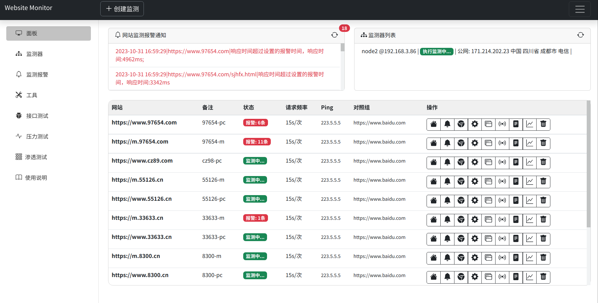
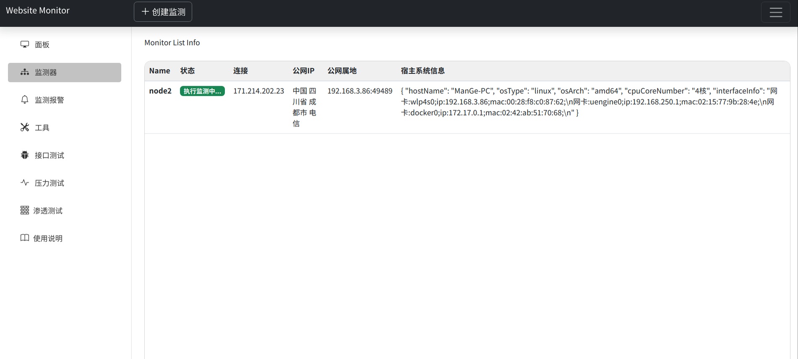
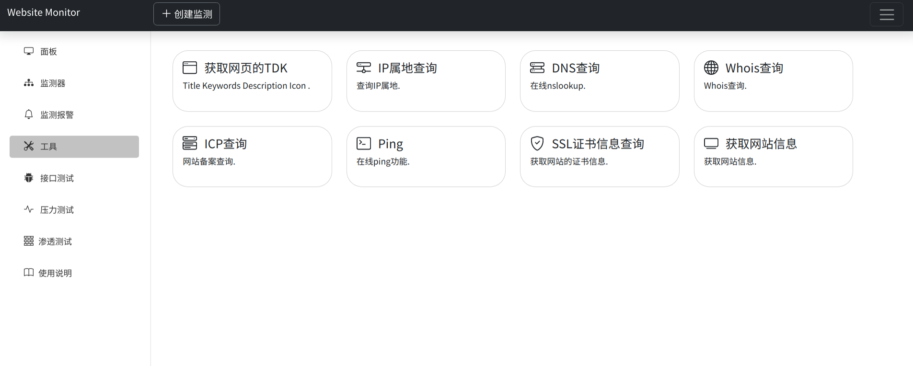

# website-monitor
网站监测平台。支持分布式监控与测试web项目,拥有接口测试,压力测试,渗透测试,请求调试功能,内置dns查询,证书查询,Whois查询,Ping,扫描等工具

## 注意
该项目为练手项目，监测只作为客观巡查网站的稳定性，内置各种探测工具，渗透工具请勿在生产环境使用。

## Master
- 提供Web管理界面
- 管理监测器
- 存储监测数据
- 分析监测数据，监测报警
- 网站信息采集 todo

## Monitor
- 接受通知执行监测任务
- 上报监测数据
- 接受通知执行工具任务 todo
- 具有伸缩性 todo
- 压力测试节点 todo
- 渗透测试节点 todo

## 场景
- Master 一对多 Monitor
- 分布式监测
- Monitor可部署在多个地域或多个运营商节点上实现对站点多地域监测
- Master可通知多个Monitor发起大量请求可对网站实现压力测试场景
- 自定义请求逻辑实现接口测试
- 其他工具，如DNS查询等等
- 渗透测试，如Sql注入排查，Xss注入排查
- Uri采集，外链采集等网站探索功能

## 监测
所有监测都是基于黑盒的

## 优势
- 网站监测报警
- 使用上手快
- 功能覆盖面广
- 工具实用性高
- 能实现性能测试，渗透测试

### 渗透
- CGI扫描
- 
